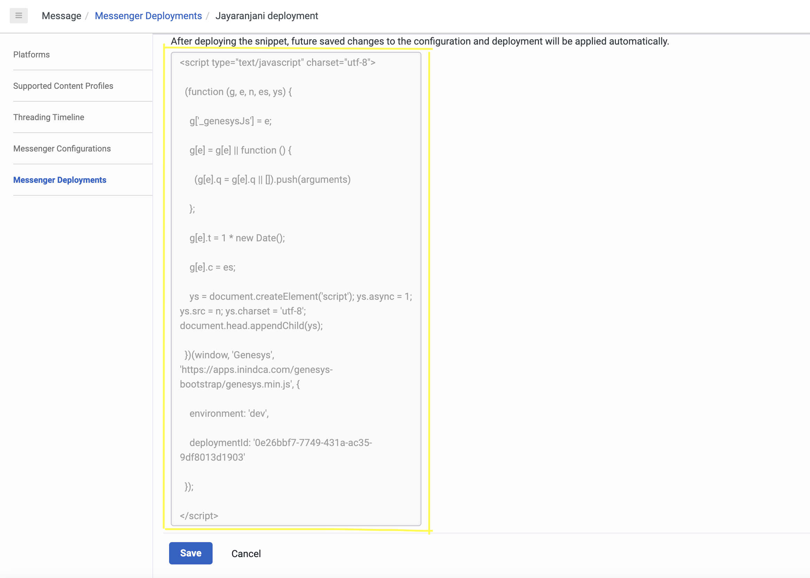

  This Genesys Cloud Developer Blueprint demonstrates how to integrate Messenger with the identity provider, Okta, in order to use SSO to authenthicate Messenger across multiple domains. This blueprint also includes the steps to set up an Okta account to obtain authorization credentials.


## Solution components

**Genesys Cloud** - A suite of Genesys cloud services for enterprise-grade communications, collaboration, and contact center management. In this solution, a Genesys Cloud user account is required for your application to be authorized to integrate with Messenger.

## Prerequisites

### Specialized knowledge

* Administrator-level knowledge of Genesys Cloud

## Genesys Cloud account

* A Genesys Cloud license. For more information, see [Genesys Cloud pricing](https://www.genesys.com/pricing "Opens the Genesys Cloud pricing page") on the Genesys website.
* (Recommended) The Master Admin role in Genesys Cloud. For more information, see [Roles and permissions overview](https://help.mypurecloud.com/?p=24360 "Opens the Roles and permissions overview article") in the Genesys Cloud Resource Center.

## Okta Developer Edition account

* An Okta Developer Edition account. For more information, see [the Okta Developer page](https://developer.okta.com/signup/ "Goes to the Okta Developer page on the Okta website").

## Implementation steps

### Set up Okta

1. Log in to your Okta Developer Edition account.
2. In the left panel, click **Applications > Applications**. 
3. Click **Create App Integration**.

  

4. On the Create a new app integration page, in the Sign-in method section, click **OpenID Connect**.
5. For the application type, select **Web Application** and then click **Next**.
6. On the New Web App Integration page, in the **App integration name** box, type a name for your app integration.
7. Select the required **Grant type**. 


8. Add the **Sign-in redirect URIs**. 
	* For local use while you are developing, add http://{local_domain_name}. Example: http://localhost:8080/. 
	* For production use, add the URL where Messenger will initialize after login.
9. Add the **Sign-out redirect URIs**.
	* For local use while you are developing, add http://{local_domain_name}. Example: http://localhost:8080/. 
	* For production use, add the appropriate URL.
10. Under **Security**, click **API** > **Trusted Origin** and add your web page origin in the Okta account.
11. In the **Assignment** section, select the option that best suits your organization and click **Save**. This creates the client credentials.
12. To find the Okta URL, navigate to **Security** > **API** and click **Default**. The Okta URL appears in the **Issuer** section.
14. Make a note of these items, which you will need later: 
 	* Okta client credentials 
	* Okta URL  

### Create an Oauth integration in Genesys Cloud

1. Log in to your Genesys Cloud account and click **Admin** > **Integrations** > **+Integrations**.

  

3. Install the **OpenID Connect Messenger Configuration**.

  

4. In the **Configuration** section, paste the Discovery Uri: `https://<okta-user-domain>/oauth2/default/.well-known/openid-configuration`.
	
  

5. In **Credentials** section, click **Configure** and provide the Okta client credentials.
6. Click **Save**.
7. On the main Integrations page, set your new integration to **Active**.

  

## Update the Messenger configuration

1. In Genesys Cloud > **Admin**, under **Message**, click **Messenger Configurations**. 
2. Enable Authentication.
3. From the list, select the [**OAuth integration** you created](#create-an-oauth-integration-in-Genesys-Cloud "Goes to Create an Oauth integration in Genesys Cloud section").

  

## Update the Messenger deployment

1. In Genesys Cloud > **Admin**, under **Message**, click **Messenger Deployments**, and then select the configuration [that you created](#update-the-messenger-configuration "Goes to the Update the Messenger configuration section").

 

3. Save the deployment. This creates the snippet that you need.
4. Deploy the snippet on the website where you want Messenger to appear.

 

:::primary
**Note**: Make a note of the deployment key and environment from the snippet. You can use these values to [run the sample authentication app](#run-the-sample-authentication-app "Goes to the Run the sample app section).
:::

## Configure the authenticated Messenger

1. Write necessary code to configure authenticated web messaging for Messenger when it runs in your webpage.

2. To enable the Okta Sign-In experience using JavaScript, do either of the following:  
  * [Enable authenticated sign-in with the Okta Auth JavaScript SDK](#enable-authenticated-sign-in-with-the-Okta-Auth-JavaScript-SDK "Goes to the Enable authenticated sign-in with the Okta Auth JavaScript SDK section).
  * [Enable authenticated sign-in with the OAuth endpoint](#enable-authenticated-sign-in-with-the-oauth-endpoint "Goes to the Enable authenticated sign-in with the OAuth endpoint section").

### Enable authenticated sign-in with the Okta Auth JavaScript SDK  

Follow these steps to include the Okta Auth JavaScript SDK in your webpage.

1. Get the [Okta Auth JavaScript SDK](https://global.oktacdn.com/okta-auth-js/5.2.2/okta-auth-js.min.js "Okta Auth JavaScript SDK"). 

2. Include the okta-auth-js library in your webpage.

	```{"title":"Okta SDK","language":"html"}
	<script src="https://global.oktacdn.com/okta-auth-js/5.2.2/okta-auth-js.min.js" type="text/javascript"></script>
	```
3. Create an instance of the OktaAuth object and configure the Okta authorization options.

	```{"title":"OktaAuth Object","language":"JavaScript"}
	const oktaConfig = {
		redirectUri: <signInRedirectUri>,
		postLogoutRedirectUri: <signOutRedirectUri>,
		clientId: <ClientId>,
		issuer: <Okta URL>,
		scopes: ['openid', 'email', 'profile', 'offline_access'],
		pkce: true,
		responseType: 'code',
		maxAge : <MaxAge>
	};
	const authClient = new OktaAuth(oktaConfig)		
	```

The OktaAuth object contains the following parameters:

| Parameter | Description |
| --------- |----------|
| redirectUri | Specify the URL to where the browser should redirect the user after they signIn. Use your full page URL, which is listed in your Okta application's Sign-in redirect URIs.|
| postLogoutRedirectUri | Specify the URL where the browser should redirect the user after signOut. Use your full page URL, which is listed in your Okta application's Sign-out redirect URIs. If you do not specify this value, your application's origin (window.location.origin) will be used.|
| clientId | Specify the clientID that was generated when you [set up your Okta app](#set-up-okta).|
| issuer | Specify the Okta URL that is listed in your Okta Developer Edition account under **Security** > **API** > **default**.|
| scopes| If required, set the auth scopes to specify the access privileges that are being requested as part of authorization.|
| pkce | The default value is true, which enables the PKCE OAuth flow. To use the Implicit flow or the Authorization Code flow, set this option to false. *Note: The PKCE Oauth flow works only with a secure domain.* |
| responseType| To use the Authorization Code grant type, set this option to **code**.|
| maxAge | Specify the allowable elapsed time, in seconds, since the last time the end user was actively authenticated by Okta.|
| nonce | This is a random string value that the Okta Auth JavaScript SDK generates. You can also pass your preferred nonce value as a paramater to the OktaAuth object if you want to overwrite the generated nonce value.|
{: class="table-striped table-bordered"}

4. To trigger the signIn action, call the **signInWithRedirect** method with the request parameters. The **originalUri** parameter tracks where the user came from before they signed in. The additional parameters are mapped to the Authorize options. You can trigger the sign-in action via a link, button, and so on.

	```{"title":"OktaAuth signInWithRedirect method","language":"JavaScript"}
	authClient.signInWithRedirect({
		originalUri: <your current page url here>,
		...oktaConfig
	});
	```

### Enable authenticatecd sign-in with the OAuth endpoint

1. Generate **Auth URL** and trigger the login action. You can trigger this action when the user clicks a link, button, or interacts with another UI element, for example.  

	```{"title":"Auth url Example","language":"html"}
	//Your request URL would look something like this

	authURL = `<DomainURL>client_id=<ClientId>&scope=openid%20email%20profile%20offline_access&response_type=code&redirect_uri=<RedirectURL>&state=eyJiYWNrVG9QYXRoIjoiL3ByaXZhdGUiLCJpc3N1ZXIiOiJva3RhIiwiYnl0ZXMiOiItSEhlWEV3YmNRak5fQWl3a0NkanVDNEZpQ1VPRV81emkzeFlKa1BQaWcwIn0%3D`

	//Your request URL would look something like this if pkce flow is enabled

	authURL = `<DomainURL>client_id=<ClientId>&scope=openid%20email%20profile%20offline_access&response_type=code&redirect_uri=<RedirectURL>&state=eyJiYWNrVG9QYXRoIjoiL3ByaXZhdGUiLCJpc3N1ZXIiOiJva3RhIiwiYnl0ZXMiOiItSEhlWEV3YmNRak5fQWl3a0NkanVDNEZpQ1VPRV81emkzeFlKa1BQaWcwIn0%3D&code_challenge_method=S256&code_challenge=<codeChallenge>`

	//Your request URL would look something like this if optional parameter(nonce & maxAge) is added

	authURL = `<DomainURL>client_id=<ClientId>&scope=openid%20email%20profile%20offline_access&response_type=code&redirect_uri=<RedirectURL>&state=eyJiYWNrVG9QYXRoIjoiL3ByaXZhdGUiLCJpc3N1ZXIiOiJva3RhIiwiYnl0ZXMiOiItSEhlWEV3YmNRak5fQWl3a0NkanVDNEZpQ1VPRV81emkzeFlKa1BQaWcwIn0%3D&nonce=<nonce>&max_age=<maxAge>`
	```

The Auth URL contains the following parameters:
	| Parameter | Description |
	| --------- |----------|
	| DomainURL | Authorization server's endpoint(https://{yourOktaDomain}/oauth2/default/v1/authorize)|
	| ClientId  | Specify the clientID which was generated when the Okta app was created. Refer [OKTA Set-Up](#okta-set-up)|
	| RedirectURL| Specify the url where the browser should be redirected after signIn. This must be your full page URL which is listed in your Okta application's Sign-in redirect URIs.|
	| Auth scopes| Set auth scopes to specify what access privileges are being requested as part of the authorization, if required.|
	| response_type| Set to **code** indicating that we are using the Authorization Code grant type|
	| max_age | Allowable elapsed time, in seconds, since the last time the end user was actively authenticated by Okta.|
	| nonce | A random string value preferably an uuid format which is returned in the ID token. |
	| codeChallenge | A string value generated from code verifier to support PKCE flow in OAuth. The code challenge is verified in the access token request. *Note: Code verifier is a random string value between 43 and 128 characters long. Okta uses it to recompute the code_challenge and verify if it matches the original code_challenge in the authorization request.* |
	| codeChallengeMethod | Method used to derive the code challenge for PKCE flow. Valid value: S256. |
		{: class="table-striped table-bordered"}

2. If the user does not have an existing session, making this request opens the **Okta** sign-in page.
3. If the user does have an existing session, they arrive at the specified redirect_uri along with a code, as shown in the code snippet.

```{"title":"Redirect url appended with code and state Example","language":"javascript"}
https://mypureclloud.com/?code=P5I7mdxxdv13_JfXrCSq&state=state-296bc9a0-a2a2-4a57-be1a-d0e2fd9bb601 // Code specifies Okta authcode
```

4. The page is reloaded when the user is redirected from the **Okta** sign-in page. The page reload initializes the [Auth plugin](https://developer.genesys.cloud/api/digital/webmessaging/messengersdk/SDKCommandsEvents#auth-plugin 'Goes to the SDK Commands and Events page') and calls its [getTokens command](https://developer.genesys.cloud/api/digital/webmessaging/messengersdk/SDKCommandsEvents#auth-plugin 'Goes to the SDK Commands and Events page') for Authentication.
5. Split the **OKTA** authcode from the redirect url.
6. Create your own authprovider plugin and register the command [getAuthCode](https://developer.genesys.cloud/api/digital/webmessaging/messengersdk/SDKCommandsEvents#authprovider-plugin 'Goes to the SDK Commands and Events page').

```{"title":"Prepare the AuthProvider plugin","language":"javascript"}
Genesys('registerPlugin', 'AuthProvider', (AuthProvider) => {

  // COMMAND
  // *********
  // getAuthCode

  const urlParams = new URLSearchParams(window.location.search); // Get the authorization response which is added as a query string from the redirect URL
  const authCode = urlParams.has('code') ? urlParams.get('code'); // Get code from the query string

  /* Register Command - mandatory */

  AuthProvider.registerCommand('getAuthCode', (e) => {

  //Messenger will call this command to get the the tokens.

  e.resolve({
      authCode: <authCode>,			// Pass your authCode here
      redirectUri: <your redirect uri>,	// Pass the redirection URI configured in your Authentication provider here
      nonce: <nonce>,				// For Sign-In using SDK approach, pass the random string value stored in session storage. For endpoint approach, generate a random string value
      maxAge: <maxAge>				// Pass elapsed time in seconds and it is an optional parameter
      codeVerifier: <codeVerifier>		// For PKCE flow : If SDK approach is used, get code verifier from session storage. If endpoint approach is used, pass a cryptographically random string which you used to generate codeChallenge
    });
  });
});
```

7. Trigger the signOut action, call the Okta Auth JavaScript SDK's **signOut** method after the [Auth.logout command](https://developer.genesys.cloud/api/digital/webmessaging/messengersdk/SDKCommandsEvents#auth-logout 'Goes to Auth provider plugin'). You could trigger this action when the user clicks a link, button, or interacts with another UI element, for example.  

```{"title":"OktaAuth signOut method","language":"JavaScript"}
AuthProvider.command('Auth.logout').finally(() => {
	authClient.signOut();
});
```

### Run the sample authentication app

This blueprint includes a sample authentication app that you can run locally or from the Blueprint repo.

:::primary
**Note**: Regardless of the location from where you run the sample app, you need a Genesys Cloud user account in order for it to work. Our sample app uses the [Okta Sign-In using SDK](#configure-authenticated-messenger) approach.
:::

To run the sample app from the Blueprint repo:

1. Click [here](https://genesyscloudblueprints.github.io/messenger-authentication-okta-integration-blueprint/oauth.html "Goes to the sample app").

2. Enter the environment and deployment Id configured with Okta and click **Submit**.

3. Enter the client credentials for authenticated web messaging.

:::info
 Refer the source code for sample app [here](https://github.com/GenesysCloudBlueprints/messenger-authentication-okta-integration-blueprint/blob/main/docs/oauth.html "Goes to source code of the sample app")
:::

##Additional resources 

* [Platform API](/api/digital/webmessaging/authenticate "Goes to the Authenticated WebMessaging page in the Genesys Cloud Developer Center").
